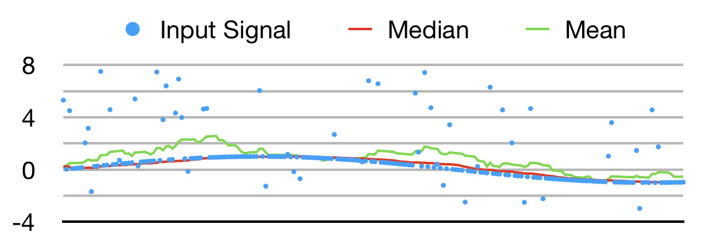
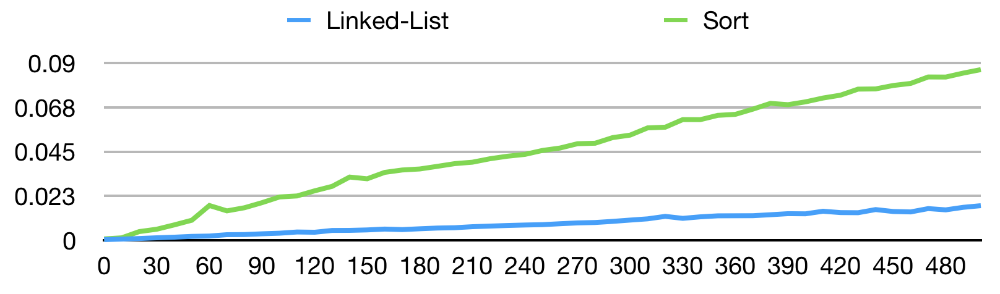

# median

[](https://travis-ci.org/regexident/median)
[](https://crates.io/crates/median/)
[](https://crates.io/crates/median/)
[](https://crates.io/crates/median/)

## Synopsis

An implementation of an efficient `O(n)` [median filter](https://en.wikipedia.org/wiki/Median_filter) in Rust.

## Motivation

> The median filter is a **nonlinear digital filtering technique**, often **used to remove noise from an image or signal**. Such noise reduction is a typical pre-processing step to **improve the results of later processing** […]. Median filtering is very widely used […] because, **under certain conditions, it preserves edges while removing noise**, also having **applications in signal processing**. ([Wikipedia](https://en.wikipedia.org/wiki/Median_filter))

### Median vs. Mean



## Usage

```rust
extern crate rand;
use rand::{Rng, XorShiftRng};

extern crate median;
use median::Filter;

let mut rng = XorShiftRng::new_unseeded();
let mut filter = Filter::new(FILTER_WIDTH);
for i in 0..INPUT_LENGTH {
    let signal = (i as f32).sin();
    let noise = rng.gen::<f32>();
    let value = signal + (noise * 0.2);
    let filtered = filter.consume(value);
    // use filtered
}
```

## Implementation

The algorithm makes use of a **ring buffer** of the same size as its filter window.
Inserting values into the ring buffer appends them to a **linked list** that is embedded
inside said ring buffer.

### Performance

The classical implementation of a median filter uses an internal buffer that is re-sorted for each input to find the median, leading to inferior performance compared to the use of a linked list embedded in a ring buffer, as used in this crate.


(lower is better)

### Example

Given a sequence of values `[3, 2, 4, 6, 5, 1]` and a buffer of size 5,  
the buffer would be filled like this:

```plain
new(5)  consume(3)  consume(2)  consume(4)  consume(6)  consume(5)  consume(1)
▶︎[ ]      ▷[3]       ┌→[3]       ┌→[3]─┐     ┌→[3]─┐    ▶︎┌→[3]─┐      ▷[1]─┐
 [ ]      ▶︎[ ]      ▷└─[2]      ▷└─[2] │    ▷└─[2] │    ▷└─[2] │    ▶︎┌─[2]←┘
 [ ]       [ ]        ▶︎[ ]         [4]←┘     ┌─[4]←┘     ┌─[4]←┘     └→[4]─┐
 [ ]       [ ]         [ ]        ▶︎[ ]       └→[6]       │ [6]←┐     ┌→[6] │
 [ ]       [ ]         [ ]         [ ]        ▶︎[ ]       └→[5]─┘     └─[5]←┘
```

### Algorithm

1. **Remove node** at current cursor (`▶︎`) from linked list, if it exists.
   (by re-wiring its predecessor to its successor).
2. **Initialize** `current` and `median` index to first node of linked list (`▷`).
3. **Walk through** linked list, **searching** for insertion point.
4. **Shift median index** on every other hop (thus ending up in the list's median).
5. **Insert value** into ring buffer and linked list respectively.
6. **Update index** to linked list's first node, if necessary.
7. **Update ring buffer**'s cursor.
8. **Return median value**.

## Contributing

Please read [CONTRIBUTING.md](CONTRIBUTING.md) for details on our [code of conduct](https://www.rust-lang.org/conduct.html),  
and the process for submitting pull requests to us.

## License

This project is licensed under the [**MPL-2.0**](https://www.tldrlegal.com/l/mpl-2.0) – see the [LICENSE.md](LICENSE.md) file for details.
